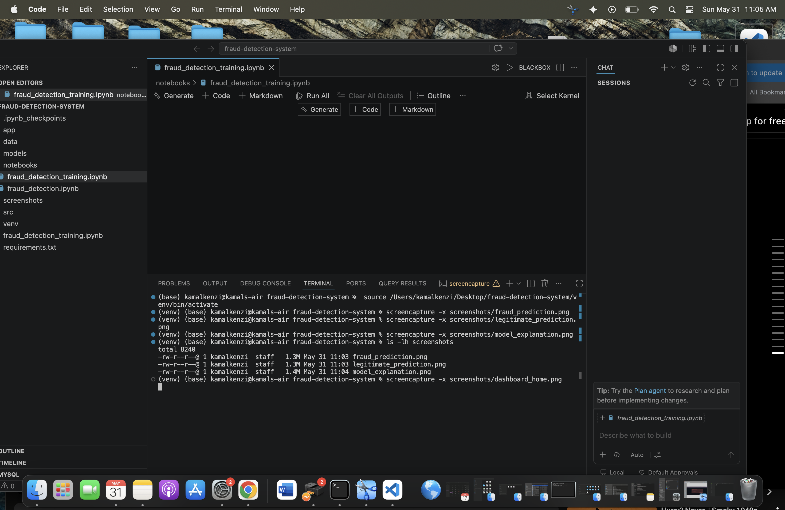
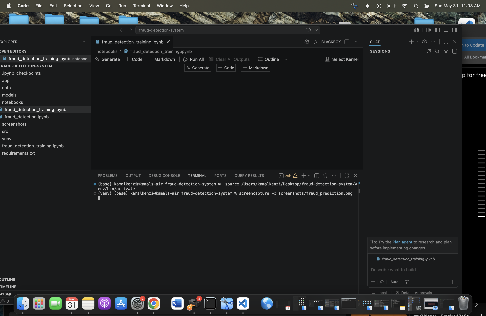
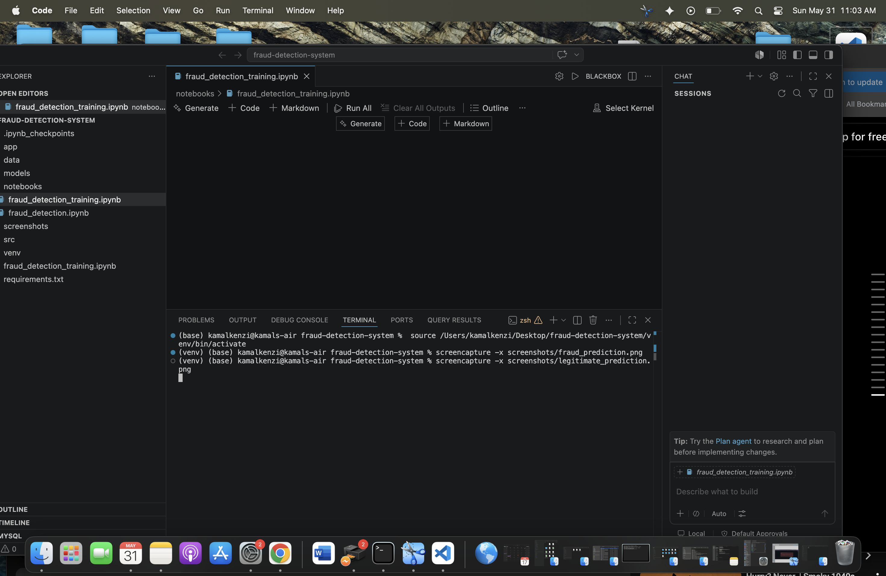

# Fraud Detection System 🚨

A machine learning-powered fraud detection system built with Python and Streamlit.

## 🚀 Features
- Real-time fraud prediction
- Interactive Streamlit dashboard
- Trained ML model using scikit-learn
- Clean UI for demo and portfolio use
- Visual explanations of model behavior

## 📸 Screenshots

### Dashboard


### Fraud Prediction


### Legitimate Prediction


### Model Explanation


## 🧠 Tech Stack
- Python
- Pandas
- NumPy
- Scikit-learn
- Streamlit

## ▶️ Run Locally

```bash
pip install -r requirements.txt
python -m streamlit run app/app.py
